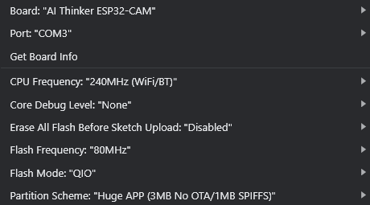

# ROVER_Prototype
 

The architecture of the whole system is as follows

# Dependencies
**ESP 32 :**

espressif boards in aduino ide

CONFIGURATION

EXTERNAL LIBRARIES:

`AsyncTCP.h ESPAsyncWebServer.h ArduinoWebsockets.h`
***
**ARDUINO**

EXTERNAL LIBRARIES:

`ArduinoJSON.h`
***

**Server.js**

NODE MODULES:

`ws path express`
***

**Python**

MODULES:

`opencv-python numpy websockets asyncio socket`
***